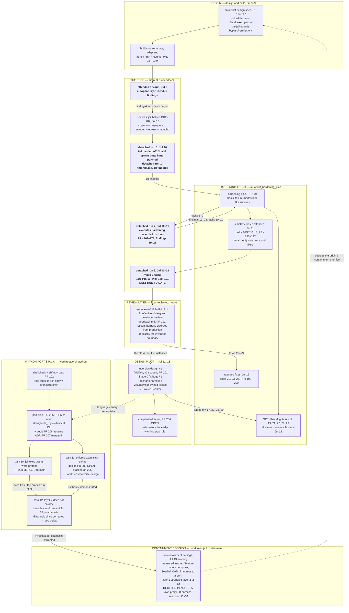

# Auto-pilot: why this work exists, and the tree it grew

Part I is the anchor: the problem the product solves, the problem the system
was actually experiencing, and the test every new piece of work should pass.
Part II is the research behind it: the chronological trunk/branch map of how
the work stream grew from the original design to today's leaves.

Every open branch in this stream should be able to answer "which part of
Part I do I serve?" This doc exists because, three plans deep, that question
had become hard to answer from any single artifact.

## Part I — the problem statement

### The original problem (the product)

You have more vetted backlog than attention. Auto-pilot exists so you can hand
it a task graph and get back **reviewable PRs without being present** —
"advance a whole task graph unattended," nothing merged, human reviews in the
morning. That is the entire product.

Everything else in the system is a _consequence_ of the word "unattended":

- no human to approve actions → `bypassPermissions` → something must bound the
  agent → **the jail**;
- no human to notice wedges → the run must monitor itself → **supervisor,
  heartbeat, alarm, doctor**;
- the human may merge its stacked PRs while it runs → **freeze rule, restack**.

None of these are the product. They are the enabling tax the product pays.

### What problem auto-pilot was actually experiencing

**Not capability.** Every run delivered its work: the dry run 1/1; run #1 6/6
in ~65 minutes (PRs #162–#167); run #2 executed nine tasks of its own hardening
plan on itself (PRs #169–#178); run #3 delivered Phase B (PRs #188–#191).
Co-review caught real bugs the workers missed (the `$-50,000.00` redaction
leak, the enum drift). The freeze rule held while a human merged under it. The
delivery loop — claim → implement → verify → PR → co-review → hand off — has
never been the thing that failed.

What it experienced was **three failures of trust**, one per layer:

1. **"Done" couldn't be trusted.** In-jail, every Bash exit code was poisoned
   to 1 (#182), and `check.sh` could not execute at all (nested Seatbelt —
   Fact 1 of the jail-containment plan). The run's verify was noise, and every
   PR carried "re-run check.sh outside the jail." The run did the work but
   could not prove it.
2. **"Alive" couldn't be trusted.** The 401 relaunch loop: ~4h14m of silence,
   ~52 relaunches, doing nothing — while every observable said healthy
   (`exit 0`, `is_error: false`, `terminal_reason: completed`). The hardening
   plan named it: _"auto-pilot's failure modes look like success"_ and
   _"silence is not health."_
3. **"Contained" couldn't be trusted.** The design's safety premise — _"the
   jail, not a human, is what bounds it"_ — was partly fiction: egress
   enforcement was never on (layer 1 strangled layer 2's loopback proxy at
   init; **not** a `bypassPermissions` effect — that earlier diagnosis is
   corrected in the jail-containment plan), exec grants were pretend until
   #208, and the egress smoke reported success precisely in the failure case
   (`/dev/tcp` is a bashism; the tool shell is zsh).

These are one problem wearing three coats:

> **The run makes claims — done, healthy, contained — and nothing outside the
> run corroborates them.**

Every stream since has attacked that disease at a different layer: hardening
attacked it operationally (doctor, exit contract, alarm), the inversion
structurally (who has authority to write verdicts), exercise-claims
epistemically (claims must be executed, not reasoned to), jail-containment at
the containment leg specifically. The reason the work keeps spawning work is
that **each fix adds another claim-making component** — a supervisor, a broker,
a proxy — which then also needs corroboration. The machinery for trusting the
machine has been growing faster than the machine.

### Which parts are inherent, and which are self-inflicted

Legs 1 and 3 are **not inherent to the product**. They are artifacts of _where
it runs_: a self-built boundary made of Seatbelt + launchd + Bash on the host.
On a substrate with a real boundary — a VM, a container, a cloud runner, even a
separate user account with scoped credentials — leg 3 reduces to "the token can
only touch this repo; GitHub enforces it server-side," and leg 1 reduces to
"tests run normally, because the jail composes." Two of the three trust
failures dissolve by moving; only engineering keeps them alive here.

Leg 2 — _tell me when you're stuck_ — **is** inherent to unattended operation.
Its minimal form is small: a heartbeat the run writes and an external watcher
that notifies a human when it stops. Most of the supervisor's mass exists to
compensate for the substrate, not to implement that.

One more measured corrective (hardening task 19): run #2 did 8 of its 9 tasks
between 06:00 and 11:35 with the human at their desk. The realized value has
been **partially attended**, which demands far less self-trust machinery than
the fully-autonomous-at-3am scenario the system keeps being hardened for.

### The problem statement (pin this)

> **I hand a vetted task graph to an agent and get back verified, reviewable
> PRs, with (a) blast radius capped by what its credentials can reach, (b) a
> heartbeat that reaches me when it's stuck, and (c) "done" meaning
> independently verified.**

### Scoring work against it

- **The delivery loop is the product, and it works.** Changes there need run
  evidence, not design conviction.
- **(a) is an identity problem before it is a syscall problem.** A repo-scoped
  fine-grained PAT and a spend cap are enforced server-side, are immune to
  every failure mode the jail has exhibited, and cost an afternoon. OS-level
  confinement is defense-in-depth on top — rented (VM/container), not
  hand-built, wherever possible.
- **(b) is a tiny external watcher**, not a state machine. If a component
  exists to decide _for_ the human whether the run is healthy, ask whether a
  notification would have done.
- **(c) is co-review plus verify-in-an-environment-where-tests-run.** Free
  everywhere except inside a Seatbelt.

The test for any new task or plan in this stream: **which of (a), (b), (c)
does it serve — or does it serve the delivery loop with run evidence behind
it?** If the honest answer is "none; it makes the enabler more elaborate," it
is not the product, and it should wait for a run to demand it.

The drift this guards against is recorded in Part II: the original why was
_PRs while you sleep_; by mid-July the operative why had become _making a
self-monitoring jailed process provably honest on macOS_ — a genuinely harder
problem than the product requires, generated almost entirely by the substrate
rather than the goal.

## Part II — the tree of work (research, 2026-07-13)

**The trunk is: a detached auto-pilot run a human can trust.** It advances only
when a run happens. Three runs happened (Jul 9–11); every branch since exists
because a run — or a review of a run's fixes — surfaced something. The last run
was **Jul 11**. Everything after Jul 12 midday is design/meta work.

### Origin

Two layers of origin, and both matter:

1. **The design root** — [`auto-pilot.md`](./auto-pilot.md) (PR #134 spec, Jul 8;
   graduated Jul 9, PR #147). One locked decision explains why every later
   stream collides with sandboxing: **"Sandboxed yolo"** — the orchestrator runs
   `bypassPermissions`, and _the jail, not a human, is what bounds it_. The jail
   was never a digression; it is the safety premise of the whole feature.
2. **The feedback root** — the improvement stream starts at
   [`autopilot-dry-run.md`](./autopilot-dry-run.md) (attended, Jul 9, 5 findings)
   and [`autopilot-detached-run-1-findings.md`](./autopilot-detached-run-1-findings.md)
   (first detached run, Jul 10, 18 ranked findings). Every branch below descends
   from these two documents.

### Chronology

| When       | Event                                                                                                                                                                                                                                                           | Artifact                                                                                         | What it spawned                                                                                    |
| ---------- | --------------------------------------------------------------------------------------------------------------------------------------------------------------------------------------------------------------------------------------------------------------- | ------------------------------------------------------------------------------------------------ | -------------------------------------------------------------------------------------------------- |
| Jul 3      | `/orchestrate-coders` ships                                                                                                                                                                                                                                     | PR #107                                                                                          | the coder-delegation substrate auto-pilot composes over                                            |
| Jul 8–9    | Auto-pilot designed + built (Linear PRE-458…468)                                                                                                                                                                                                                | PRs #134–#147, `dev_docs/auto-pilot.md`                                                          | the feature itself                                                                                 |
| Jul 9      | **Attended dry-run** (Step-7 spawn skipped)                                                                                                                                                                                                                     | `autopilot-dry-run.md`                                                                           | `--until` guard, `--handler` override, and **PRE-484: build the spawn + jail helper** (finding #4) |
| Jul 10     | Spawn + jail built (PRE-484, `autopilot_spawn_jail_plan`)                                                                                                                                                                                                       | PRs #151, #153, spawn commit                                                                     | `scripts/spawn-orchestrator.sh` — seatbelt + egress + launchd                                      |
| Jul 10     | **Detached run #1** (linear-fastpath-p2): 6/6 handed off, but 3 fatal spawn bugs hand-patched                                                                                                                                                                   | `autopilot-detached-run-1-findings.md` (18 findings)                                             | the hardening plan                                                                                 |
| Jul 10–11  | **Detached run #2** executes hardening tasks 1–9 _on auto-pilot itself_; breaks in 5 new ways                                                                                                                                                                   | PRs #169–#178; findings 19–23; plan committed as PR #179                                         | tasks 10–20                                                                                        |
| Jul 11     | Attended "substrate batch" (tasks 10, 12, 13, 18) — proves in-jail verify was returning noise                                                                                                                                                                   | PRs #181–#187                                                                                    | Phase B cleared                                                                                    |
| Jul 11–12  | **Detached run #3** (Phase B: tasks 11, 14, 15, 16) — **the last run to date**                                                                                                                                                                                  | PRs #188–#191                                                                                    | the co-review that changed everything                                                              |
| Jul 12     | Co-review of #188–#191: 3 of 4 PRs defective while green                                                                                                                                                                                                        | [`auto-pilot-developer-review-feedback.md`](./auto-pilot-developer-review-feedback.md) (PR #192) | tasks 22–29; the inversion question                                                                |
| Jul 12     | Attended fixes: tasks 20, 23–27; supervisor ledger untracked                                                                                                                                                                                                    | PRs #193–#200                                                                                    | —                                                                                                  |
| Jul 12–13  | **The pivot**: inversion v1 ("one root cause, rewrite") → adversarially falsified → v2 scoped                                                                                                                                                                   | [`auto-pilot-inversion-design.md`](./auto-pilot-inversion-design.md) + 2 codex reviews (PR #201) | Stage 0–3 plan; complexity tracker                                                                 |
| Jul 13     | Shell quality tooling finds real bugs **only** in `spawn-orchestrator.sh` (6,284 lines)                                                                                                                                                                         | PR #202                                                                                          | the Python port plan                                                                               |
| Jul 13     | **Python port stack** (`.worktrees/orch-python`): plan #205 → audit #206 → runtime ADR #207                                                                                                                                                                     | `orch_py_plan/`, `decisions/script_language.md`                                                  | tasks 10–12 found _by_ the port                                                                    |
| Jul 13     | Port side-finds: task 10 jail-exec fix (**#208 merged**); task 11 → exercise design (**#209 open**); task 12 filed: "layer 2 does not enforce"                                                                                                                  | `orch_py_task_10/11/12.md`, `designs/enforce-exercising.md`                                      | the containment investigation                                                                      |
| Jul 13 eve | **Jail-containment findings**: nested Seatbelt cannot compose; Seatbelt CAN pin egress to a port; layer 1 strangled layer 2 — task 12's `bypassPermissions` diagnosis corrected; agent observed disabling its own dead sandbox; codex fabricated output in-jail | `jail_containment_plan.md` (branch `bestdan/jail-containment-findings`)                          | **the containment decision**: A own proxy / B harness sandbox / C VM-container                     |

### Trunk / branch flow

### How the work drifted (four generalization steps)

Each step is one level more abstract than the last. None was irrational; the
sum is how a bug-fix stream became an epistemics program:

1. **Bugs** → run #1's 18 findings: concrete spawn/jail/adapter defects.
2. **Classes of bugs** → hardening plan: "auto-pilot's failure modes look like
   success" — doctor, exit contract, alarms, heartbeat (tasks 14–16, 20).
3. **Authority architecture** → inversion design: "the agent authors the
   verdicts that gate it" — leases, unforgeable verdicts, watch/worker.
4. **Process epistemics** → exercise-claims design + complexity tracker:
   "load-bearing claims get asserted, never executed."

The feedback loop also changed character at step 3: through Jul 12 morning the
input was **runs**; after that the input became **reviews of the fixes** — the
system stopped being exercised and started being reasoned about. (The
jail-containment findings are the healthy exception: reviews that _executed_
their claims — the exercise-claims lesson paying off.)

### Where the leaves stand relative to the trunk

| Leaf                                                        | State                                           | Trunk-relevant?                                                                                                                                                                              |
| ----------------------------------------------------------- | ----------------------------------------------- | -------------------------------------------------------------------------------------------------------------------------------------------------------------------------------------------- |
| Jail-containment plan (`bestdan/jail-containment-findings`) | OPEN — plan on branch, decision (A/B/C) pending | **Yes — it IS the trunk decision.** Its task 1 ADR chooses who enforces the boundary. Scored by Part I (a): rent the boundary (C) rather than build a fifth generation of it (A).            |
| `orch-py-task-12` — layer-2 egress                          | branch + worktree cut Jul 13, no commits        | Superseded as filed: the card's `bypassPermissions` diagnosis is wrong and its stated fix would not have worked (measured). Fold into the containment decision; do not implement as written. |
| Hardening tasks 17, 19, 21, 22, 28, 29                      | `new`, idle since Jul 12                        | **Yes.** 17 (TCC consent blocks detached launch) and the Stage-0 set (22, 28, 29) gate a clean run #4.                                                                                       |
| Inversion Stages 1–3                                        | approved on paper, nothing built                | Stage 1 (scenario harness) was declared "first, not last" — it has no branch yet.                                                                                                            |
| PR #205 port (+ #206/#207 in)                               | OPEN, docs-only so far                          | Lateral. Justified by code quality, but it ports the component the containment decision may delete; its task 5 is already gated on that decision.                                            |
| PR #209 exercise-claims design                              | OPEN, stacked on #205                           | Meta — but demonstrably effective: the containment findings exist because its rule was followed.                                                                                             |
| PR #204 complexity-tracker                                  | OPEN                                            | Meta (instruments a stop-rule for a rewrite that hasn't started).                                                                                                                            |

### The way back to the trunk

The trunk's next commit is **detached run #4 on a real, non-auto-pilot plan.**
Judged from the origin, the order is:

1. **Make the containment decision once** (jail plan task 1, as an ADR),
   scored against Part I (a). The record-corrections and the vacuous-smoke fix
   (tasks 1 and 3 of that plan) are cheap and true under any choice. A
   repo-scoped PAT + spend cap are worth doing regardless — server-side,
   immune to every measured failure mode.
2. **Close Stage 0** — hardening 17, 22, 28, 29 (+ 21 rescoped per the
   inversion: re-verify on the restacked SHA, drop the line-survival audit).
3. **Launch run #4.** Its findings — not further review passes — decide which
   of #204 / #205 / #209 earns continuation. This is the inversion doc's own
   rule applied to the meta-work: measure before committing.

### Reading order from the origin

1. [`auto-pilot.md`](./auto-pilot.md) — what it is; the locked decisions
   (read "Sandboxed yolo" twice).
2. [`autopilot-dry-run.md`](./autopilot-dry-run.md) — attended run; the seams.
3. [`autopilot-detached-run-1-findings.md`](./autopilot-detached-run-1-findings.md)
   — the 18 findings; the origin of the hardening stream.
4. `dev_docs/tasks/autopilot_hardening_plan/autopilot_hardening_plan.md`
   (untracked scaffolding, working tree) + [`auto-pilot-hardening.md`](./auto-pilot-hardening.md)
   — the plan, its STATUS, and the "failure looks like success" thesis.
5. [`auto-pilot-developer-review-feedback.md`](./auto-pilot-developer-review-feedback.md)
   — why green suites lied; the class-level lessons.
6. [`auto-pilot-inversion-design.md`](./auto-pilot-inversion-design.md) (+ the two
   codex review docs) — the scoped pivot; what is approved vs. explicitly not.
7. `.worktrees/orch-python`: `dev_docs/tasks/orch_py_plan/orch_py_plan.md`,
   `dev_docs/decisions/script_language.md`, `dev_docs/orchestrator-python-port.md`
   — the port and its constrained-tier trace.
8. `.worktrees/exercise-design`: `dev_docs/designs/enforce-exercising.md` — the
   epistemics leaf.
9. `.worktrees/jail-containment`:
   `dev_docs/tasks/jail_containment_plan/jail_containment_plan.md` — the two
   measured facts and the pending containment decision.

Notes: the plan directories under `dev_docs/tasks/` are git-ignored
scaffolding — they exist in the working tree and on run-state branches, not on
`main` (by design; see run-#1 finding #13). The `orch-py-task-12` branch was
cut on Jul 13 (worktree `.worktrees/orch-py-task-12`, no commits yet) — before
implementing it, read the jail-containment plan's correction of its diagnosis.
