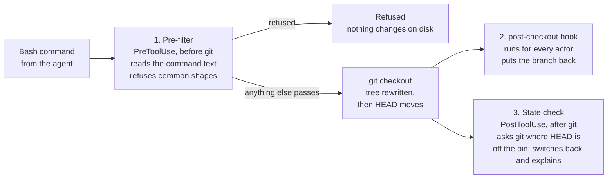

# Pinned-checkout guard — design v2

Protect a fact about state, the pinned main checkout's `HEAD` staying on its
branch, instead of predicting it from shell text alone. The design has three
layers:

1. A narrow text pre-filter that refuses the common shapes before anything moves.
2. The existing git `post-checkout` hook, which covers actors that are not Claude.
3. A state check after every Bash call, which asks git where `HEAD` is and puts
   it back.

One override, `env WORKFLOW_SKILLS_ALLOW_HEAD_MOVE=1`, is honoured by all three.

For PR #951 this means: cut the copyable bypass replay, keep every fix that
changes a refusal, add a scope rule, and merge. The state check and the rest
ship as follow-up issues in the "Pinned-checkout guard" milestone.

## Goal and invariant

**Invariant:** in a repo with `hooks.pinnedBranch` set, the main checkout's `HEAD`
is a symbolic ref to that branch. Linked worktrees are never pinned.

**Why it matters:** the machine reads that working tree (a hooks path, tool pins,
symlinks, agent config). Switching its branch reconfigures the machine, and
nothing errors when it happens.

**Requirements:**

- An agent that tries to move `HEAD` off the pin is stopped, and pointed at a
  linked worktree.
- Branch work inside a linked worktree is never blocked, including
  `cd <worktree> && git checkout -b x`.
- A human can override one command deliberately.
- A detached `HEAD` that already exists, such as during a rebase or a bisect, is
  never put back. An explicit `checkout --detach` or `switch --detach` in the
  main checkout is a move off the pin, and is refused like any other.

**Non-goal:** stopping a determined human. The guard protects against agents and
accidents. It is not an access control.

## Why the text-only approach does not converge

The guard answers a question about state (where will `HEAD` be?) by predicting
it from command text. Each review round of PR #951 sampled an open-ended set of
shapes, and each one found new ones.

| Round     | Found                                                                                                                | Kind                                   |
| --------- | -------------------------------------------------------------------------------------------------------------------- | -------------------------------------- |
| 1         | A failed `cd` declines to judge; the bypass line was wrong for new branches; the target was not shell-quoted         | Prediction gap; replay fidelity        |
| 2         | The replay dropped the start point, `--track`, and the `switch --orphan` semantics                                   | Replay fidelity                        |
| 3         | `--detach <pin>` and a bare `--detach` were waved through; the replay dropped git's own options                      | Prediction gap; replay fidelity        |
| 4         | A crash after `cd -` plus an absolute `-C`; clustered `-qd`; the replay was wrong behind `sudo`, `env -i`, `bash -c` | Crash; prediction gap; replay fidelity |
| Step-back | `gh pr checkout`, git aliases, `git symbolic-ref`, `git stash branch`, scripts that call git                         | Prediction gap                         |

Two patterns stand out. First, most findings were in the copyable bypass line,
which serves the user rather than protecting the checkout: 3 of the PR's 5
commits and 7 of its 37 tests were about it. Second, the prediction gaps never
close, because the set of shapes that move `HEAD` has no end. The splitter in
`scripts/bash_command.py` is quote-blind by design, which caps how precisely the
text can be read.

## Design

The pre-filter is the only layer that acts before git runs, and only for its
in-scope shapes. It is what keeps `git checkout x && ./setup.sh` from running
`setup.sh` on `x`, and it also saves those shapes a double tree write. The
state check detects and repairs a move after the whole Bash call returns. For a
shape the pre-filter lets through, any command chained after the checkout in
the same call runs on the wrong branch first. The state check repairs that move
afterwards; it does not enforce the invariant at every moment.

| Layer                   | When                         | Sees                       | Decides by              | Covers                                                                                                                                                                                            |
| ----------------------- | ---------------------------- | -------------------------- | ----------------------- | ------------------------------------------------------------------------------------------------------------------------------------------------------------------------------------------------- |
| 1. Pre-filter (PR #951) | Before git runs              | Claude's Bash command text | Parsing in-scope shapes | Common shapes only; nothing on disk changes                                                                                                                                                       |
| 2. git `post-checkout`  | After the checkout           | Every actor's checkout     | git's own arguments     | Every actor, where the hook is installed                                                                                                                                                          |
| 3. State check (new)    | After each Bash call returns | The repo's actual `HEAD`   | `git symbolic-ref`      | Repairs moves that finish during a foreground Bash call, parsed or not, after any chained commands have run; not MCP tools, background processes, other sessions or a human terminal (question 5) |

Layers 2 and 3 overlap on purpose. The git hook runs inside `git checkout`,
before the shell reaches a chained `&&`, so where it is installed it closes the
same-call window that the state check leaves open. It needs `core.hooksPath` or
a per-repo install, while the state check needs only the plugin. The timing of
`post-checkout` is inferred from githooks, not tested.

## The override

There is one spelling, and every layer honours it: `env
WORKFLOW_SKILLS_ALLOW_HEAD_MOVE=1` as the first words of the command that runs
git.

- **Pre-filter:** honoured only as an assignment on that git call's own segment.
  Naming the variable elsewhere (`rg WORKFLOW_SKILLS_ALLOW_HEAD_MOVE; git checkout x`)
  disarms nothing.
- **State check:** honoured when any segment of the command sets the variable in
  its leading assignments, read with `bash_command.segments` and nothing more.
  This is looser than the pre-filter, because the state check cannot tell
  which segment moved `HEAD`: `env WORKFLOW_SKILLS_ALLOW_HEAD_MOVE=1 true; git checkout x`
  passes it. The pre-filter still refuses that shape before git runs, and the
  non-goal accepts the gap.
- **git `post-checkout`:** reads the variable from its environment. The dotfiles
  hook accepts both this name and `DOTFILES_ALLOW_HEAD_MOVE` (dotfiles #934 and
  #937).

**How long an override lasts.** An honoured move stands until someone switches
back by hand, which is what `post-checkout` already does after a bypass. The
state check therefore acts only on a move that happened during the current Bash
call. A PreToolUse hook records `HEAD`, keyed by the call's `tool_use_id` so
that parallel calls do not collide, and the PostToolUse check compares against
that record. Without this, a deliberate move a human made in a terminal would
be undone by the next Bash call in that repo, from any Claude session. The
refusal and unpin messages promise no automatic return to the pin.

The refusal message gives a fixed sentence, not a rebuilt command: re-run the
same command with `env WORKFLOW_SKILLS_ALLOW_HEAD_MOVE=1` immediately before the
`git` word. The agent already holds the exact command it ran.

Claude Code's `ask` decision is not used as the override, because the
`post-checkout` hook only knows the variable and would undo a move the person
had just approved. `ask` may still suit one case: a shape the pre-filter cannot
resolve that names `checkout` or `switch` (question 4 below).

## Scope rule

The pre-filter judges plain commands, and everything else falls through to the
state check by design. This rule goes in the guard's docstring and the README,
and it is what ends the review loop.

**In scope:** `[cd <dir> &&] [env VAR=1] git [global options] checkout|switch …`.

**Out of scope, let through by design:** executors (`bash -c`, `eval`, `ssh`),
subshells and `$(…)`, wrappers with options (`sudo -u`, `env -i`), an
unresolvable or failed `cd`, git aliases, `git symbolic-ref`, `git stash branch`,
and scripts.

A review finding on the pre-filter counts as a defect only in these cases:

1. A false positive on an in-scope shape. That blocks the workflow the pin
   pushes people toward.
2. A crash. A crashing hook lets the command through.
3. A missed refusal on an in-scope shape.

A miss on an out-of-scope shape is closed as "by design; the state check covers
it".

## Changes to PR #951, and follow-ups

Trim #951 to the refusal decision and merge it. The state check is the next PR.

**Cut from #951:**

- the replay helpers: `_simple`, `_bypass_line` and `_GENERIC_BYPASS`;
- the extra values passed down to build the replay: `plain`, `shell_cwd` and
  `call`, including the fourth value `git_calls` now returns;
- the 7 or so bypass-line tests.

The refusal ends with the fixed sentence instead.

**Keep in #951:**

- `cd` tracking, `-C` and `--work-tree` resolution, and the per-call bypass;
- the refusal fixes: `--orphan=`, `--detach` both at the pin and bare, and
  clustered `-qd`;
- the fix for the crash after `cd -`;
- the hook registration and its tests.

**Add to #951:** the scope rule, in the docstring and the README.

**Follow-up issues, in the same milestone:**

- **State check:** a PreToolUse and PostToolUse pair on Bash, about 80 lines,
  using no parser beyond `bash_command.segments`.
  - From the payload's `cwd` it finds the main worktree and reads
    `hooks.pinnedBranch`. Before the call it records
    `git symbolic-ref --short -q HEAD`, keyed by `tool_use_id`, and after the
    call it reads `HEAD` again.
  - If `HEAD` was on the pin before the call and is on another branch after it,
    and no segment carries the bypass assignment, it switches back and says why.
  - Like `post-checkout`, it leaves a detached `HEAD` alone.
  - The restore is a plain `git checkout <pin>`, never forced. If it fails, for
    example on a dirty tree, it leaves the tree untouched and prints a loud
    message naming the current branch and the manual fix. A test covers that
    failure path. After a failed restore, `HEAD` is the same before and after
    the next call, so the move is not flagged again: either keep a "restore
    pending" marker, or accept the message as the only signal.
- **`gh pr checkout <n>`:** add it to the pre-filter's in-scope shapes.
- **An opt-in setup script:** it sets the pin and, when `core.hooksPath` is
  unset, installs a `post-checkout` hook in `.git/hooks`. It has to run outside
  the sandbox, which denies writes to `.git/hooks`.
- **Re-scope #932 (refusal routes):** make the message fixed. It names the pin,
  gives one worktree suggestion and the bypass sentence, and says how to unpin.
- **Longer term:** have the machine read its config from a dedicated checkout
  that nobody works in. That removes the need to predict anything.

## Verified and inferred

| Claim                                                                                        | Status                            | How                                                          |
| -------------------------------------------------------------------------------------------- | --------------------------------- | ------------------------------------------------------------ |
| git has no hook that runs before a checkout                                                  | Verified                          | `man githooks`, git 2.43.0 on this machine                   |
| A `reference-transaction` veto leaves the other branch's files staged with `HEAD` on the pin | Verified by the owner; not re-run | dotfiles `pinned-checkout` skill; matches git's source order |
| Blocking writes to `.git/HEAD` (sandbox, chmod) fires after the tree is rewritten            | Inferred                          | Same source order; not tried                                 |
| PostToolUse cannot block, but receives `cwd` and the command, and can run git                | Verified                          | Claude Code hooks reference                                  |
| PostToolUse fires when the Bash command exits non-zero                                       | Unverified                        | Matters little: a checkout that moves `HEAD` exits 0         |
| `ask` behaves sensibly in headless and auto modes                                            | Unverified                        | Assume it degrades to a denial                               |
| Both guards miss `gh pr checkout`, aliases and `symbolic-ref`                                | Verified                          | Searched both guards' source                                 |
| The global `core.hooksPath` points at the dotfiles hooks on this machine                     | Verified                          | `git config --global core.hooksPath`                         |
| The sandbox denies writes to `.git/hooks` and `.git/config`                                  | Verified                          | Sandbox docs; seen in this session                           |

## Questions to pressure-test

1. **Is restoring after the fact acceptable?** The state check runs after the
   tree has already been rewritten. Until the restore, the machine reads the
   wrong branch's files, and a restore can fail on a dirty tree. The window
   includes the rest of the same Bash call: a chained `just`, `dli` or
   `setup.sh` runs against the wrong tree before the state check fires. How long
   is that window in practice, and what else runs inside it (a file watcher,
   another session)?
2. **Should the state check restore, or only report?** Restoring is automatic
   but can collide with the agent's next command. Reporting leaves the repo moved
   until someone acts.
3. **Does the pre-filter still earn its place** once the state check exists? It
   saves the common shapes a double tree write, but every line of it is review
   surface.
4. **Is `ask` right for shapes the pre-filter cannot resolve** (an executor or
   subshell that names `checkout` or `switch`), rather than letting them through
   silently? What does `ask` do when no one is there to answer?
5. **Which sessions does the state check miss?** It sees only Claude's Bash
   tool. A Python script the agent runs, an MCP server, or a human terminal is
   covered only where `post-checkout` is installed.
6. **Detached `HEAD`:** the requirements refuse an explicit detach but never put
   back an existing one. The state check and `post-checkout` both leave a
   detached `HEAD` alone, so a detach the pre-filter misses (for example inside
   `bash -c`) is never caught. Should the state check treat on-pin to detached
   during a call as a move, unless a rebase or bisect is in progress?
7. **Is the scope rule specific enough** that a reviewer can apply it without
   arguing? Try it on the round-4 findings.
8. **The structural fix:** if the machine read its config from a dedicated
   checkout, would any of this still be needed?
